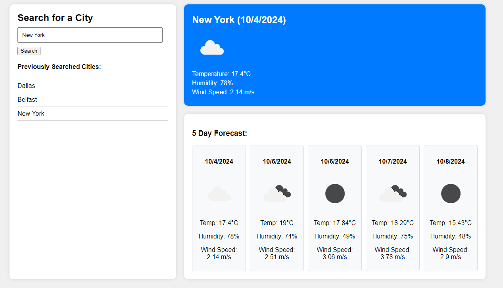

# Weather-Dashboard

## Description

A search for the next five days' forecast, displaying weather data for each day

## Installation
n/a

## Assets
Use [this link](https://treytaylersmith.github.io/Weather-Dashboard/) to visit the page.

## Usage

Allows you to search a city and see its weather forecast

## Credits
OpenWeather API
SMU Coding Bootcamp

## License

Please refer to the LICENSE in the repo.